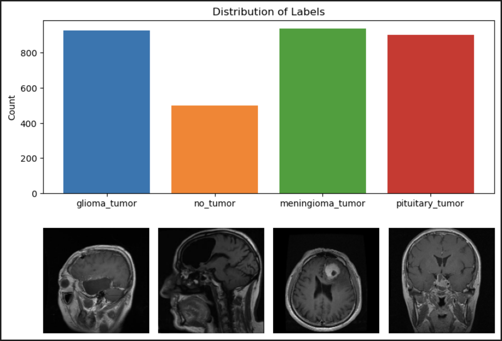
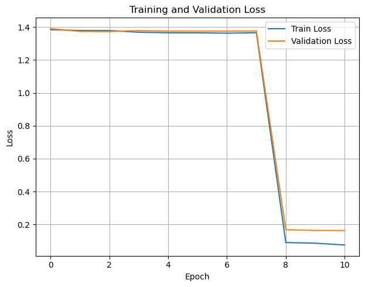
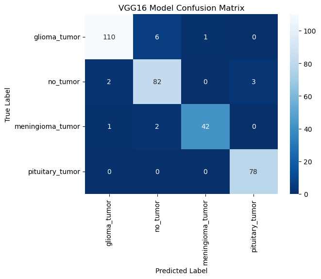

# MRI Tumor Recognition Using Computer Vision Via Augmented VGG16

## Table of Contents:
* Purpose
* Installation Requirements
* Instrutions
* Data
* Model Overview
* Model Details
* Model Training
* Results Summary
* Future Uses and Improvements

## Purpose
The purpose of this brain imaging machine learning model is to enhance the speed and accuracy of brain tumor classification, aiding healthcare professionals in identifying tumor types more efficiently. By leveraging deep learning to classify tumors based on MRI images, this project aims to accelerate intervention and treatment planning, ultimately supporting improved patient outcomes. Inspired by a background in the medical field, the project’s author combines expertise in healthcare with machine learning to create a tool that facilitates rapid diagnostic insights and complements existing medical practices.

## Installation Requirements:
The required packages are stored in the [requirements.txt](https://github.com/LeahLou622/MRI-Tumor-Recognition/blob/main/requirements.txt) file of this repository. 

## Instructions
1. Follow the link https://mri-tumor-recognition.streamlit.app/
2. Upload an MRI image of the brain
3. scroll down and read the results, which will categorize the image as Giloma Tumor, Meningioma Tumor, Pituitary Tumor, or No Tumor. 

## Data
The training, validation, and test sets of this ML model were gathered and augmented from open [Kaggle](https://www.kaggle.com/datasets/masoudnickparvar/brain-tumor-mri-dataset) data set.

## Model Overview
This project is a brain tumor classification model built on a convolutional neural network (CNN) architecture. The model is designed to analyze MRI images and classify brain tumors into four categories: three types of tumors and one "no-tumor" class. Using TensorFlow and Keras, it leverages transfer learning based on the VGG16 architecture, which is renowned for its success in image recognition tasks. The architecture has been tailored to suit our classification requirements by adding custom layers at the top, enabling it to handle the specific medical imaging classification needs of this project.

Images were split into categories and analyzed for Distributiion to assess any imbalances in the 4 categories to assess what augmentation techniques would be the best. 

Images were split into train, validation, and test sets. 

Images were augmented, a seed was set to control variability with testing hyperparameters. 

## Model Details:
* Input Layer: Accepts MRI images of size 150x150 with three color channels.
* Convolutional Blocks: The VGG16 model comprises five convolutional blocks, each with multiple convolutional layers followed by max pooling layers. These blocks enable the model to extract increasingly complex features from MRI images, starting with simple shapes and progressing to detailed tumor features.
* Global Average Pooling Layer: This layer reduces the spatial dimensions, helping to limit overfitting and improve model generalization.
Dropout Layer: A dropout layer is added to further prevent overfitting, particularly valuable in medical imaging, where data variety can be limited.
* Dense Output Layer: Finally, a dense layer with four neurons is used for classification, corresponding to the four categories of brain tumors.

The total number of parameters is approximately 14.7 million, all of which are trainable due to unfreezing the entire model, enhancing its ability to learn from our specific dataset. This level of complexity allows the model to capture the nuances needed for accurate tumor classification.

 Layer (type)                Output Shape              Param    
=================================================================
 input_4 (InputLayer)        [(None, 150, 150, 3)]     0         
                                                                 
 block1_conv1 (Conv2D)       (None, 150, 150, 64)      1792      
                                                                 
 block1_conv2 (Conv2D)       (None, 150, 150, 64)      36928     
                                                                 
 block1_pool (MaxPooling2D)  (None, 75, 75, 64)        0         
                                                                 
 block2_conv1 (Conv2D)       (None, 75, 75, 128)       73856     
                                                                 
 block2_conv2 (Conv2D)       (None, 75, 75, 128)       147584    
                                                                 
 block2_pool (MaxPooling2D)  (None, 37, 37, 128)       0         
                                                                 
 block3_conv1 (Conv2D)       (None, 37, 37, 256)       295168    
                                                                 
 block3_conv2 (Conv2D)       (None, 37, 37, 256)       590080    
                                                                 
 block3_conv3 (Conv2D)       (None, 37, 37, 256)       590080    
                                                                 
 block3_pool (MaxPooling2D)  (None, 18, 18, 256)       0         
                                                                 
 block4_conv1 (Conv2D)       (None, 18, 18, 512)       1180160   
                                                                 
 block4_conv2 (Conv2D)       (None, 18, 18, 512)       2359808   
                                                                 
 block4_conv3 (Conv2D)       (None, 18, 18, 512)       2359808   
                                                                 
 block4_pool (MaxPooling2D)  (None, 9, 9, 512)         0         
                                                                 
 block5_conv1 (Conv2D)       (None, 9, 9, 512)         2359808   
                                                                 
 block5_conv2 (Conv2D)       (None, 9, 9, 512)         2359808   
                                                                 
 block5_conv3 (Conv2D)       (None, 9, 9, 512)         2359808   
                                                                 
 block5_pool (MaxPooling2D)  (None, 4, 4, 512)         0         
                                                                 
 global_average_pooling2d_3   (None, 512)              0         
 (GlobalAveragePooling2D)                                        
                                                                 
 dropout_3 (Dropout)         (None, 512)               0         
                                                                 
 dense_3 (Dense)             (None, 4)                 2052      
                                                                 
=================================================================
Total params: 14,716,740
Trainable params: 14,716,740
Non-trainable params: 0
_________________________________________________________________

## Model Training:
To improve training performance and optimize the model's accuracy, the author uses several callbacks in Keras:

* TensorBoard: TensorBoard(log_dir='logs') allows us to monitor training progress in real time by logging important metrics. This visualizes the model’s learning over time, aiding in evaluating adjustments and tuning.

* ModelCheckpoint: ModelCheckpoint("vgg16_best_model.keras", monitor="val_accuracy", save_best_only=True, verbose=1) saves the model only when there is an improvement in validation accuracy. This ensures that we retain the best version of the model throughout training.

* ReduceLROnPlateau: ReduceLROnPlateau(monitor='val_accuracy', factor=0.1, patience=2, min_delta=0.0001, verbose=1) reduces the learning rate by a factor of 0.1 if validation accuracy plateaus for two epochs. This enables finer adjustments during training to prevent overshooting optimal weights and helps the model learn more effectively as training progresses.

* EarlyStopping: EarlyStopping(monitor='val_loss', patience=5, restore_best_weights=True, verbose=1) stops training if the validation loss doesn’t improve after five epochs, preventing overfitting and unnecessary training. With restore_best_weights=True, the model resets to its best state, retaining optimal parameters achieved during training.

These callbacks together provide a dynamic, adaptive approach to training, aiming to maximize model performance while avoiding overfitting and inefficient training cycles.

The model was trained over 17 Epochs and acheived >95% accuracy.

## Results Summary
Overall Accuracy: 95%

Precision: 
* Strong across classes, especially high in Class 2 (98%) and Class 0 (97%).
Recall: 
* Consistently high with the best recall for Class 3 (100%) and Class 1 (94%).
F1-Score: 
* Maintains high scores across classes, particularly for Class 3 (0.98) and Class 0 (0.96).

              precision    recall  f1-score   support

           0       0.97      0.94      0.96       117
           1       0.91      0.94      0.93        87
           2       0.98      0.93      0.95        45
           3       0.96      1.00      0.98        78

    accuracy                           0.95       327
   macro avg       0.96      0.95      0.95       327
weighted avg       0.95      0.95      0.95       327

1/1 [==============================] - 0s 67ms/step

Predicted label: pituitary_tumor
Confidence: 99.99%
Actual label: pituitary_tumor

## Future Uses and Improvements:
This MRI tumor classification model has the potential for ongoing refinement and integration into real-world healthcare applications. Some possible future directions and enhancements include:

* Expanded Dataset and Tumor Types: Expanding the dataset to include more diverse MRI images and additional tumor types could enhance the model’s applicability across different tumor classifications and improve diagnostic flexibility.

* Integration with Clinical Systems: Developing integrations with clinical management systems (e.g., PACS) could allow medical professionals to leverage this model directly in their workflows, potentially reducing diagnosis time and supporting early intervention.

* Transfer Learning from Advanced Architectures: Exploring advanced architectures, such as EfficientNet or Vision Transformers, could lead to performance gains in both accuracy and inference speed. This may be particularly beneficial for resource-constrained clinical environments.

* Real-Time Prediction and Mobile Support: Implementing real-time prediction capability and deploying the model on mobile or edge devices could expand accessibility, allowing clinicians to use the model in remote or low-resource areas where immediate diagnostic assistance is needed.

* Continuous Training with Fresh Data: Setting up a pipeline for continuous training with anonymized data from new cases would help keep the model updated, adapting to trends and variations over time and enhancing accuracy in a production setting.

By implementing these improvements, the model could become a more reliable, accessible, and valuable tool in clinical practice, assisting healthcare providers in tumor classification and early intervention strategies.
